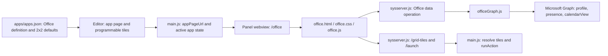

# Office App: Current State and Suggested Improvements

**Assessment date:** 2026-08-11  
**Status:** Source-verified current-state review; no implementation changes made

## Scope

This review covers the Microsoft 365 panel experience, its Microsoft Graph data adapter, its programmable buttons, and its integration with the open-quake panel host.

OAuth authorization, token storage, provider configuration, scopes, and the Office session capability are explicitly out of scope. They are treated as an existing boundary that should be preserved. None of the improvements below requires changing the currently granted Microsoft Graph scopes.

The Understand Anything graph was used to locate the presentation components and their architectural layer. The graph currently records `office.html`, `office.css`, and `office.js` in the presentation layer, but it does not capture the full runtime chain. The findings below were therefore verified against current source.

## Executive summary

The Office app is a useful read-only Microsoft 365 dashboard, but it currently behaves more like an early data display than a finished touchscreen workflow. It shows identity, presence, and five upcoming calendar entries, alongside four configurable launcher tiles. The host-side Graph boundary is small and understandable.

The main gaps are:

1. Calendar times can be displayed incorrectly because the Graph response time zone is not carried into the renderer.
2. The programmable buttons duplicate the native panel grid with a less capable implementation: no semantic buttons, no launch result, no merged-tile layout, and no visible knob selection.
3. The calendar is informational only. It does not promote the current/next meeting or offer context-aware **Join meeting** and **Open event** actions.
4. Profile and calendar requests fail as one unit, error states are coarse, and stale/empty states are not communicated clearly.
5. Tests cover the security boundary and a happy-path Graph response, but not time zones, partial failures, event rendering, or button interaction.

The best first step is to migrate Office's four launcher buttons to the existing native button strip, then harden and normalize the calendar DTO before adding meeting-aware actions.

## Current architecture



### Catalog and editor

- `apps/apps.json:140-156` registers Office as a served built-in app with a fixed 2 × 2 in-page grid.
- Default tiles open Outlook, Teams, OneDrive, and Microsoft 365 in the PC's default browser.
- The shared editor can replace these defaults with any supported tile action, icon, merge, or grid size.
- Because Office declares `def.grid`, `app/config.js:1299-1306` treats the grid as built in and always rendered inside the app rather than as the panel's native button strip.

### Renderer and layout

- `app/office.html:10-31` defines two panels: a large identity/calendar panel and a fixed action-grid panel, plus a full-screen connection prompt.
- `app/office.css:25-45` uses a two-column layout with a hard-coded 240 px action column. The main content fills the remaining width.
- `app/office.js:53-66` always renders five calendar rows, filling missing entries with visually empty cards.
- `app/office.js:74-95` independently rebuilds the launcher grid and polls its configuration every three seconds.
- The theme and accent are read once from query parameters. Live theme updates are injected by the panel host through its existing served-page mechanism.

### Microsoft 365 data

- `app/officeGraph.js:24-43` obtains a valid existing Microsoft connection and performs three parallel Graph v1.0 requests:
  - profile: display name and user principal name;
  - presence: availability/activity;
  - the next 24 hours of the default calendar, ordered by start time, limited to five events.
- Presence failure is tolerated and returned as `null`. Profile or calendar failure rejects the whole load.
- `app/office.js:96-117` refreshes once per minute and prevents overlapping refreshes.
- The client shows the profile name, one presence label, event start time, subject, and either location or `showAs`.

### Button execution

- `/grid-tiles` resolves the active app's configured tile icons through the normal host path (`app/main.js:194-205`).
- Tapping an Office tile calls `/launch?i=N`; the main process executes the configured action through `runAction`.
- URLs are constrained to HTTP(S) before they are opened externally (`app/main.js:207-221`, `app/main.js:959-964`).
- The renderer ignores both HTTP failure and an `{ ok: false }` launch result.

### Existing test coverage

- `test/oauthSecurity.test.js:183-215` verifies the Graph origin, current operation set, result shape, and a successful three-request load.
- The same suite has focused coverage for the Office service boundary and credential non-disclosure.
- There are no renderer tests for calendar formatting, event states, empty/error states, touch buttons, merged tiles, or knob interaction.

## Findings and recommendations

### OFF-001 — Calendar time zone is discarded

**Priority:** P1  
**Area:** Integration correctness

`officeGraph.js` does not send `Prefer: outlook.timezone`, and it returns each Graph `dateTimeTimeZone` object unchanged. `office.js:41-44` then passes only `start.dateTime` to `Date`. Microsoft Graph returns event start/end in UTC when no preferred time zone is supplied, while the accompanying `timeZone` value is separate. A zone-less UTC value can therefore be interpreted by JavaScript as local wall time.

**Suggested improvement:** Normalize event time in the main process and return an unambiguous instant (for example, an ISO string with `Z`) plus display-zone metadata. Alternatively, supply an explicit supported Windows time-zone name in `Prefer: outlook.timezone` and still return the zone with the DTO. Add tests for UTC, British Summer Time, a non-UK time zone, and all-day events.

Microsoft reference: [List calendarView](https://learn.microsoft.com/en-us/graph/api/user-list-calendarview?view=graph-rest-1.0).

### OFF-002 — Office duplicates the native grid with weaker buttons

**Priority:** P1  
**Area:** Buttons and panel consistency

`office.js:74-91` renders interactive tiles as `<div>` elements with `onclick`. They have no button semantics, focus state, disabled/busy state, accessible name beyond visible text, or success/failure feedback. This diverges from the native grid in `app/index.js:100-124`, which already uses safe DOM construction, merged-tile geometry, hit feedback, and the panel's established input paths.

**Suggested improvement:** Remove the in-page Office grid and migrate Office to the native button strip:

- preserve the existing 2 × 2 defaults and user-customized tiles;
- set existing Office pages to `gridOn: true` and `gridAlign: right` through the normal config migration/defaulting path;
- let the native strip own sizing, rendering, touch feedback, merged tiles, mouse input, knob selection, and action dispatch;
- remove Office's `/grid-tiles` polling after migration.

This is preferable to maintaining another Office-specific button component and aligns with the 48 × 48 px minimum touch target in `docs/design-system.md`.

### OFF-003 — Knob selection is invisible on the in-page grid

**Priority:** P1  
**Area:** Hardware interaction

The panel host knows about the Office tile array, so `selectMove` can change `knobSel` and `knobEnter` can launch that tile. However, `app/index.js:418-435` can only draw the selection on the native grid or native web strip. Office's grid lives inside the guest page, so the selected button is not highlighted. The result is an action that can be fired without the user seeing which button is selected.

**Suggested improvement:** Resolve this through the native-strip migration in OFF-002. If the in-page grid is retained, define a small, generic trusted-app selection protocol so the host can set and clear a guest tile highlight; do not add an Office-only workaround.

### OFF-004 — Merged tiles are editable but not rendered correctly

**Priority:** P1  
**Area:** Button layout

The shared editor supports `w`, `h`, and `cover` for Office tiles. `office.js:79-87` skips covered cells but never applies the owning tile's `grid-column` or `grid-row` span. A merged button therefore occupies one cell while the covered area becomes empty.

**Suggested improvement:** Use the native strip, whose `makeTile` already applies spans (`app/index.js:100-107`). If migration is deferred, port the same span behavior and add a regression test for 2 × 1 and 2 × 2 merged tiles.

### OFF-005 — The screen lacks a clear current/next meeting focus

**Priority:** P1  
**Area:** Touchscreen information hierarchy

All five events receive equal visual weight. The page does not distinguish an in-progress meeting, the next meeting, later events, all-day events, cancelled events, or free/tentative states. Empty slots are rendered as blank cards. This conflicts with the design system's guidance that Calendar's focal point should be the current meeting and that empty space should communicate purpose.

**Suggested improvement:** Recompose the 1920 × 480 layout around three predictable regions:

1. **Context:** account and presence;
2. **Primary content:** current/next meeting with relative time, duration, location, and state;
3. **Secondary/actions:** a compact later-agenda list and the native launcher strip.

Use an explicit “No more events today” state instead of empty cards. Keep the layout stable across loading, active, empty, and error states.

### OFF-006 — No context-aware meeting actions

**Priority:** P1  
**Area:** Microsoft 365 integration

The only actions are four generic web destinations. The calendar DTO discards the opportunity to act on the meeting currently being displayed.

**Suggested improvement:** With the existing calendar permission, select and normalize only the event fields the UI needs, including `id`, `subject`, `start`, `end`, `location`, `showAs`, `isAllDay`, `isCancelled`, `isOnlineMeeting`, `onlineMeeting`, and `webLink`. Then expose:

- **Join meeting** when a safe HTTPS join URL is present;
- **Open event** for the selected current/next event;
- **Open calendar** as a stable fallback.

Route these through a fixed Office action operation in the main/service layer, keyed by an event identifier or a short-lived server-side item, rather than turning the Office renderer into an arbitrary URL launcher. Preserve the existing Office authorization boundary and do not add scopes.

Microsoft references: [event resource type](https://learn.microsoft.com/en-us/graph/api/resources/event?view=graph-rest-1.0) and [online meetings in Outlook calendar](https://learn.microsoft.com/en-us/graph/outlook-calendar-online-meetings).

### OFF-007 — Partial integration failure becomes a whole-screen failure

**Priority:** P1  
**Area:** Resilience

The three requests use `Promise.all`. Presence has a local fallback, but profile and calendar do not. A temporary profile failure prevents usable calendar data from reaching the page; a calendar failure also discards a valid profile. After a previous successful load, the renderer leaves old content visible while showing a generic error, without marking it stale.

**Suggested improvement:** Fetch the three sources independently and return a sectioned DTO such as:

```json
{
  "ok": true,
  "generatedAt": "2026-08-11T12:00:00.000Z",
  "profile": { "ok": true, "data": {} },
  "presence": { "ok": false, "code": "unavailable" },
  "calendar": { "ok": true, "events": [] }
}
```

Let each established screen region render loading, current, stale, empty, or unavailable state independently. Keep the previous successful calendar briefly on transient failure and show its last-updated time.

### OFF-008 — Graph errors lose actionable detail and retry guidance

**Priority:** P2  
**Area:** Reliability

`officeGraph.js:16-19` collapses every non-2xx result into `graph_request_failed` and discards the Graph error code and `Retry-After`. The renderer therefore cannot distinguish a transient outage, throttling, missing consent, or an unsupported account. Its fixed one-minute polling continues regardless.

**Suggested improvement:** Map safe, non-sensitive failure categories in the main process. Respect `Retry-After` for HTTP 429 and use bounded exponential backoff when it is absent. Do not immediately retry failed operations. A batch request is optional: it reduces round trips, but each subresponse must still be handled independently and can be throttled independently.

Microsoft references: [Graph throttling guidance](https://learn.microsoft.com/en-us/graph/throttling) and [JSON batching](https://learn.microsoft.com/en-us/graph/json-batching).

### OFF-009 — Calendar response is broader than the UI contract

**Priority:** P2  
**Area:** Integration efficiency and contract clarity

The calendar request limits count and order but does not use `$select`, so the main process receives a much larger event object than the UI needs and forwards it largely unchanged. This makes the renderer depend directly on Graph response shapes.

**Suggested improvement:** Define an Office-specific DTO in `officeGraph.js`, use `$select` for the required event fields, and expose only normalized display/action data. Keep raw Graph objects out of the renderer. This will also make unit tests smaller and prevent future UI work from accidentally depending on irrelevant Microsoft fields.

### OFF-010 — Launch and grid failures are silent

**Priority:** P2  
**Area:** Button feedback

The button click handler catches only fetch rejection and does not inspect HTTP status or the returned `{ ok }` value. Grid polling also suppresses all errors. Users receive no pressed, busy, successful, or failed state.

**Suggested improvement:** The native-strip migration provides standard press feedback. In addition, make the launch route's result visible to the panel host and show a short, calm failure message when an action cannot be executed. Preserve the most recent valid grid if refresh fails and expose a subtle stale indicator only when useful.

### OFF-011 — Visual language is inconsistent with the rest of the panel

**Priority:** P2  
**Area:** UI polish

The page uses several non-system spacing values (10, 12, 14, and 18 px), a 26 px title rather than the documented typography scale, equal card treatment for every event, and mixed one-character/emoji launcher icons. The action column's fixed 240 px width produces narrow, tall tiles rather than the square proportions used by the native strip.

**Suggested improvement:** Adopt the documented 8/16/24/32 spacing scale and title/body/status hierarchy. Use the native strip's sizing and a consistent icon family or user-configured images. Reserve accent color for the primary meeting action and meaningful status rather than applying it to unrelated labels.

### OFF-012 — Functional tests stop at the service boundary

**Priority:** P2  
**Area:** Testability

Current tests prove the sensitive boundary but not the user-visible behavior.

**Suggested improvement:** Add focused `node:test` coverage for:

- Graph DTO normalization and `$select` construction;
- time-zone conversion and DST boundaries;
- current, upcoming, all-day, cancelled, and empty calendar states;
- independent profile/presence/calendar failures;
- 429 `Retry-After` and backoff behavior;
- Office page migration to the native strip while preserving customized tiles;
- merged-tile geometry and action index mapping;
- safe Join/Open action allowlisting;
- renderer states, using extracted pure formatting/view-model functions where practical.

## Recommended target state

The Office app should remain a narrow, read-oriented Microsoft 365 integration with host-owned privileged operations. Its renderer should consume a stable Office DTO and answer, at a glance:

- Who is connected and what is their availability?
- What meeting is happening now or next?
- When and where is it?
- Can I join or open it?
- What comes after it?
- Which configured launcher action do I want?

The launcher grid should be the same native component used elsewhere in open-quake, not an Office-specific copy.

## Suggested delivery sequence

### Phase 1 — Correctness and button consistency

1. Add failing tests for time zones, partial Graph failures, merged Office tiles, and page migration.
2. Introduce a normalized Office DTO with explicit instants, event state, and a minimal `$select`.
3. Migrate Office's in-page grid to the native right-hand strip, preserving existing user tiles and enabling visible knob selection.
4. Replace blank event placeholders with stable loading/empty/error regions.

### Phase 2 — Useful calendar actions

1. Promote current/next meeting as the visual focal point.
2. Add fixed, host-controlled **Join meeting**, **Open event**, and **Open calendar** actions using fields available under the current permissions.
3. Add action feedback and safe external-URL validation tests.

### Phase 3 — Resilience and polish

1. Add section-level stale/last-updated states.
2. Respect throttling guidance and introduce bounded backoff.
3. Align spacing, typography, icons, and light/dark states with the panel design system.
4. Verify the complete flow at 1920 × 480 with touch, mouse, knob selection/enter, both themes, and user-customized grids.

## Files likely affected by a future implementation

- `app/office.html`
- `app/office.css`
- `app/office.js`
- `app/officeGraph.js`
- `apps/apps.json`
- `app/main.js` (Office page migration/defaulting and fixed Office actions)
- `app/sysserver.js` (fixed Office action operations only)
- `app/config.js` (only if the generic app-grid model needs adjustment)
- `test/oauthSecurity.test.js` or a new focused `test/office*.test.js`
- user-facing Office documentation, which does not currently exist as a dedicated guide

OAuth provider definitions, authorization flow, token persistence, and credential handling should remain untouched for this work.
